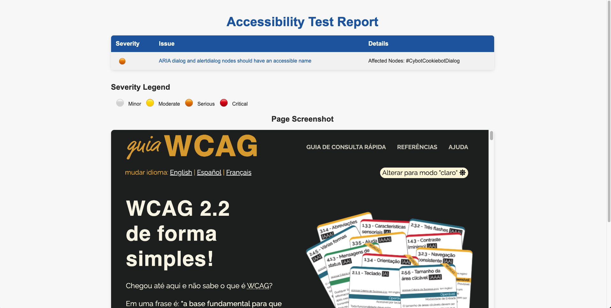

***

> O projeto Cypress Axe é uma integração do [Cypress](https://www.cypress.io/) com a biblioteca de acessibilidade [Axe-Core](https://github.com/dequelabs/axe-core). Que permite a realização dos testes de acessibilidade em aplicativos web de forma rápida e fácil.
> 
> Cypress13 está sendo utilizado no projeto.

## :open_file_folder: Organização do projeto

A organização de pastas do projeto.

```
root
├── cypress
│   ├── e2e
│   │   ├── features
│   │   ├── step_definitions
│   ├── fixtures
│   ├── report
│   ├── reports
│   ├── support
│   ├── utils
├── .nvmrc
├── cypress.config.js
├── cypress.env.json
├── package.json
├── .gitignore
```

<br>

## 💻 Instalação

- Para utilizar o Cypress Axe em seu projeto, basta instalar o pacote via npm:

```
npm install
```

## :scroll: Como usar

- Para usar o Cypress Axe em seus testes, você precisa primeiro adicioná-lo ao seu arquivo `cypress/support/e2e.js`. Adicione a seguinte linha ao seu arquivo:

``` JS
import 'cypress-axe';
```

Em seguida, você pode usar o comando `cy.injectAxe()` para injetar o Axe-Core na página que está sendo testada:

``` JS
describe('Teste de acessibilidade', () => {
  it('Não deve conter violações de acessibilidade', () => {
    cy.visit('https://exemplo.com');
    cy.injectAxe();
    cy.checkA11y();
  });
});
```

## :scroll: Configurações

O Cypress Axe possui algumas configurações que podem ser definidas no seu arquivo de suporte.

### Configuração global

Você pode defin`ir configurações globais para todos os testes, adicionando o seguinte código ao seu arquivo `cypress/support/commands.js`:

``` JS
import { configureAxe } from 'cypress-axe';

configureAxe({
  rules: {
    'color-contrast': { enabled: false }
  }
});
```

### :scroll: Configuração por teste

Você também pode definir configurações por teste, adicionando um objeto de configuração como segundo argumento do comando `cy.checkA11y()`:

``` JS
describe('Teste de acessibilidade', () => {
  it('Não deve conter violações de acessibilidade', () => {
    cy.visit('https://exemplo.com');
    cy.injectAxe();
    cy.checkA11y(null, {
      rules: {
        'color-contrast': { enabled: false }
      }
    });
  });
});
```

## Executando o Cypress

Use a task ```npm run cypress:open``` para executar com a interface gráfica ou ```npm run cypress:run``` para executar no terminal.

## Report HTML

Após a execução sem a interface gráfica com o comando ```npm run cypress:run```, caso um erro seja encontrado um relatório é criado na pasta ```"cypress/reports/accessibility-report-{getTime}.html"```


## Comandos uteis

Exemplo de possíveis configurações:

``` JS
// Verifica todas as falhas de acessibilidade da página.
cy.checkA11y(null, null, reportHTML)

// Exclui o elemento com a classe '.color-mode-dark' da verificação.
cy.checkA11y({ exclude: ['.color-mode-dark'] }, null, reportHTML)

// Realiza a verificação apenas no elemento com a classe '.color-mode-dark'.
cy.checkA11y('.color-mode-dark', null, reportHTML)

// Verifica falhas com impacto crítico ou sério.
cy.checkA11y(null, { includedImpacts: ['critical', 'serious'] }, reportHTML)

// Exclui a regra de contraste de cores.
cy.checkA11y(null, { rules: { 'color-contrast': { enabled: false } } }, reportHTML)

// Exclui contraste e verifica impacto sério/crítico.
cy.checkA11y(null, { includedImpacts: ['critical', 'serious'], rules: { 'color-contrast': { enabled: false } } }, reportHTML)
```